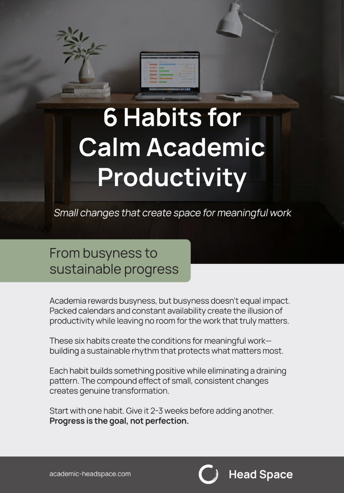

Thanks for confirming. I'll only send newsletters out when I think there's genuinely something worth sharing.

## Your free guide

As a thank-you, here's a short guide on building sustainable habits for academic work:

**[Download: 6 Habits for Calm Academic Productivity](/Guides/Head%20Space%20-%206%20Habits%20for%20Calm%20Academic%20Productivity.pdf)**

Six practical habits for the sustained concentration that scholarship requires, without the productivity-culture noise.

## Where to start

A few places worth exploring while you're here:

- **[[Courses/AI literacy/index|AI literacy for academics]]**: a free course on developing real competence with AI tools, designed for people in higher education
- **[[Posts/index|Recent posts]]**: shorter pieces on AI, knowledge work, and scholarly practice
- **[[Essays/index|Essays]]**: longer, more developed arguments on themes I keep returning to

---

*You can manage your subscription or unsubscribe at any time using the link at the bottom of any newsletter.*
